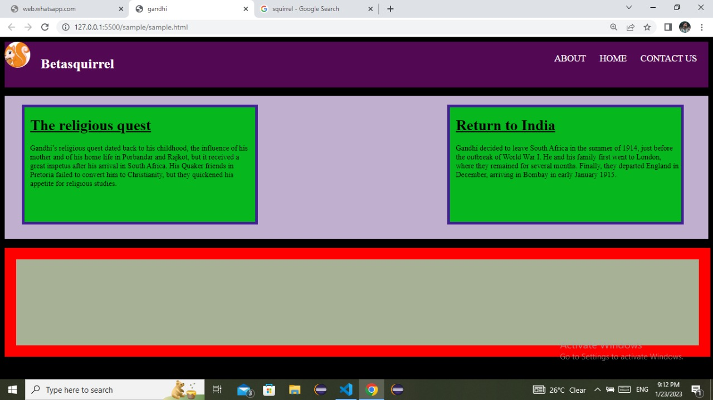
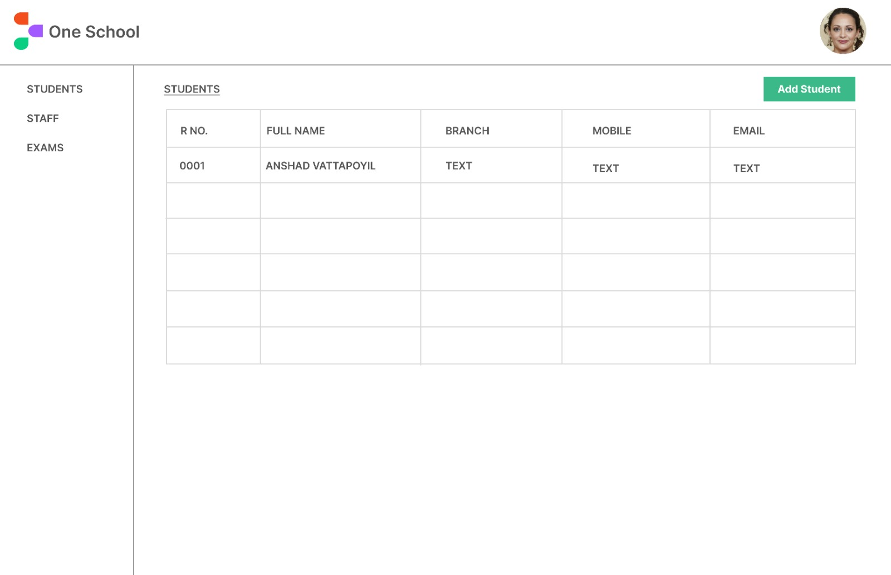
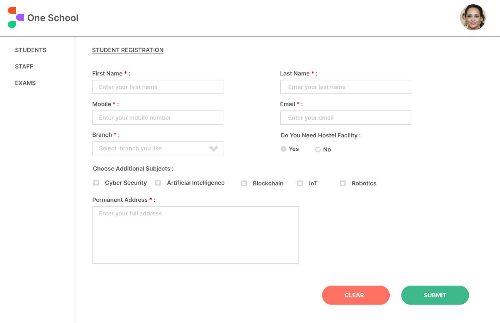
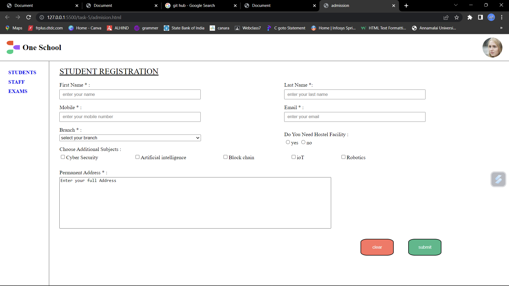

# betasquirrel-tasks

Assignments from betasquirrel

## Demo

- [Live](https://shamsad12.github.io/betasquirrel-tasks/)

## Tasks

| Requirements                     | Output                               |
| -------------------------------- | ------------------------------------ |
|    |      |
|    | ![Output 2]l(screenshot/out2.jpg)    |
|    |      |
|    |      |
|  |  |

## Task 3

Read the below links and attend exercises.

- [HTML HOME](https://www.w3schools.com/html/default.asp)
- [HTML Introduction](https://www.w3schools.com/html/html_intro.asp)
- [HTML Editors](https://www.w3schools.com/html/html_editors.asp)
- [HTML Basic](https://www.w3schools.com/html/html_basic.asp)
- [HTML Elements](https://www.w3schools.com/html/html_elements.asp)
- [HTML Attributes](https://www.w3schools.com/html/html_attributes.asp)
- [HTML Headings](https://www.w3schools.com/html/html_headings.asp)
- [HTML Paragraphs](https://www.w3schools.com/html/html_paragraphs.asp)
- [HTML Styles](https://www.w3schools.com/html/html_styles.asp)
- [HTML Formatting](https://www.w3schools.com/html/html_formatting.asp)
- [HTML Quotations](https://www.w3schools.com/html/html_quotation_elements.asp)
- [HTML Comments](https://www.w3schools.com/html/html_comments.asp)
- [HTML Colors](https://www.w3schools.com/html/html_colors.asp)
- [HTML CSS](https://www.w3schools.com/html/html_css.asp)
- [HTML Links](https://www.w3schools.com/html/html_links.asp)
- [HTML Images](https://www.w3schools.com/html/html_images.asp)
- [HTML Id](https://www.w3schools.com/html/html_id.asp)
- [HTML Classes](https://www.w3schools.com/html/html_classes.asp)

## Linux Commands

- `cd` - Change current directory. Ex: `cd Desktop`, `cd ..`
- `ls` - List contents of a directory. Ex: `ls -a` lists hidden files as well.
- `pwd` - Display current working directory path.
- `cat` - Display contents of a file. Ex: `cat README.md`
- `mkdir new folder` -for new folder.
- `clear` -to clear

## Git Commands

1. `git config` - Configure git user. Ex: `git config --global user.name "SHAMSAD12"`, `git config --global user.email "shamsadvkmd@gmail.com"
2. `git clone` - Clone a remote git repo to your local. Ex: `git clone https://github.com/SHAMSAD12/betasquirrel.git`
3. `git add` - Add your file changes to git. Ex: `git add .`, `git add README.md`
4. `git commit` - Commit changes to git. Ex: `git commit -m "Initial commit"
5. `git push` - Push your local commits to remote repo. Ex: `git push origin main`
6. `git pull` - Pull updates your current local working branch. Ex: `git pull new-folder`

## Task 5

- [HTML Favicon](https://www.w3schools.com/html/html_favicon.asp)
- [HTML Tables](https://www.w3schools.com/html/html_tables.asp)
- [HTML Table Borders](https://www.w3schools.com/html/html_table_borders.asp)
- [HTML Table Sizes](https://www.w3schools.com/html/html_table_sizes.asp)
- [HTML Table Headers](https://www.w3schools.com/html/html_table_headers.asp)
- [HTML Table Padding & Spacing](https://www.w3schools.com/html/html_table_padding_spacing.asp)
- [HTML Table Colspan & Rowspan](https://www.w3schools.com/html/html_table_colspan_rowspan.asp)
- [HTML Table Styling](https://www.w3schools.com/html/html_table_styling.asp)
- [HTML Table Colgroup](https://www.w3schools.com/html/html_table_colgroup.asp)

##linkedin and stack overflow

-[LINKEDIN](https://www.linkedin.com/in/shamsad-ahmed-23a2301b3/)

-[STACKOVERFLOW](https://stackoverflow.com/users/21194128/shamsad-ahmed)
